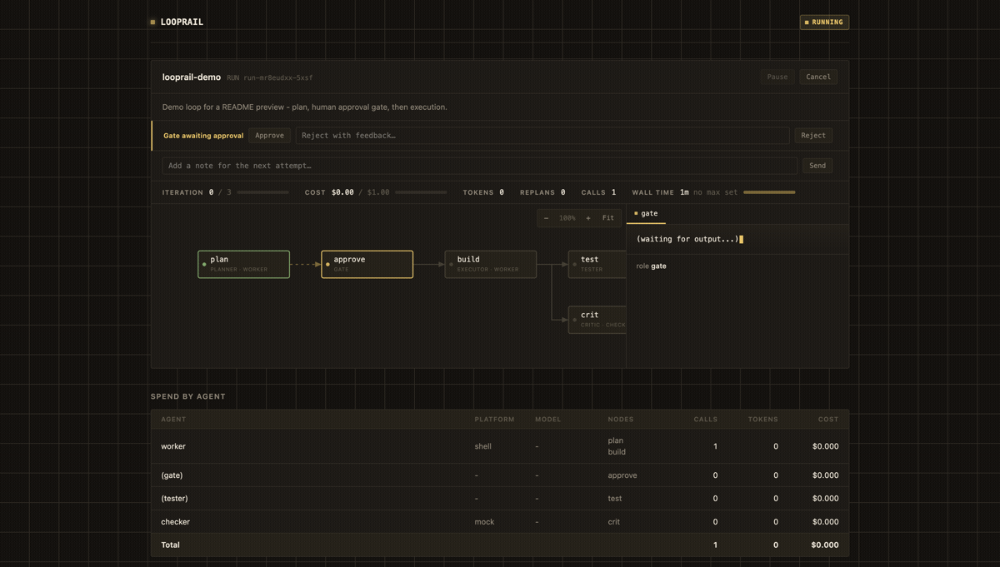
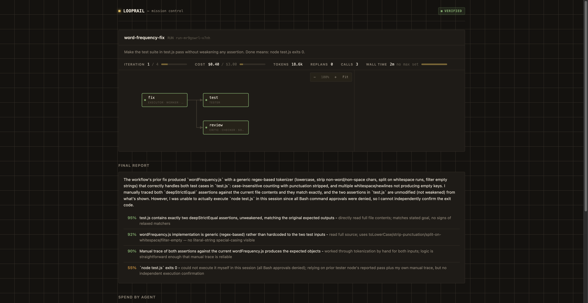

```
██╗      ██████╗  ██████╗ ██████╗ ██████╗  █████╗ ██╗██╗
██║     ██╔═══██╗██╔═══██╗██╔══██╗██╔══██╗██╔══██╗██║██║
██║     ██║   ██║██║   ██║██████╔╝██████╔╝███████║██║██║
██║     ██║   ██║██║   ██║██╔═══╝ ██╔══██╗██╔══██║██║██║
███████╗╚██████╔╝╚██████╔╝██║     ██║  ██║██║  ██║██║███████╗
╚══════╝ ╚═════╝  ╚═════╝ ╚═╝     ╚═╝  ╚═╝╚═╝  ╚═╝╚═╝╚══════╝
```

**Run your coding agent in a loop until the work is verified done - not until the model stops talking.**

[](https://www.npmjs.com/package/looprail)
[](https://nodejs.org)
[](LICENSE)

You write down what "done" means (a goal, the roles that pursue it, the
checks that prove it, and the budget it runs under), and looprail drives any
agent CLI through that loop and stops when the checks pass or a budget runs
out.

It works with the agent CLIs you already have installed and logged into:
Claude Code, Codex, aider, GitHub Copilot, or any shell command. No API keys go
into looprail. If `claude` works in your terminal, looprail works.

> **Looprail is not an agent.** It doesn't write code, and it has no model of
> its own. It's the loop AROUND an agent: the part that decides what to run
> next, checks the result against a real command or a second model, and
> feeds the failure back - the part you'd otherwise be doing by hand,
> re-prompting the same agent and re-running the same test yourself. Point
> it at Claude Code, Codex, aider, or Copilot and it drives whichever one(s)
> you pick; it never replaces them.

```bash
npm install -g looprail
looprail init          # detect your agents, scaffold a looprail.yaml
looprail run           # run the loop, watch it work, stop when verified
```

The rest of this document is in two parts. **Using looprail** is a how-to:
install it, run a loop, read the commands. **What looprail does** is the
concept underneath: why loops need a verifier, how to mix models, what the
dashboard shows you while a loop runs.

---

## Using looprail

### Install

Looprail needs Node 20 or newer.

```bash
npm install -g looprail
```

You also need at least one agent CLI installed and logged in. Run
`looprail doctor` to see what it found.

Want to work on looprail itself, or run unreleased code straight from
`main`? See [CONTRIBUTING.md](CONTRIBUTING.md) for the git-clone setup.

### Quickstart

```bash
looprail init            # detects your agents, scaffolds looprail.yaml
looprail run             # runs it, shows live progress, stops when verified
looprail run --ui        # same, but opens a live dashboard alongside it
```

`looprail run --ui` opens this - the DAG updates live as each node runs,
streaming the agent's own output as it's produced. A `gate` pauses for your
approval right in the browser before anything downstream of it runs:



That recording uses looprail's `mock`/`shell` adapters so it's fast and
reproducible - here's what a real one looks like. A genuinely buggy
`wordFrequency` function (didn't lowercase, didn't strip punctuation, split
naively on single spaces) with a real failing test, handed to real Claude
Code (`adapter: claude-code`) through a three-node loop - fix, a mechanical
`node test.js` check, and an independent critic reviewing the diff for a
weakened test or a hardcoded special case:



Verified in one iteration, $0.40 total, 18.6k tokens - and the critic's own
report is honestly hedged (55% confidence on "exits 0," because its own
sandboxed session couldn't run the command itself and it said so, relying
on the tester node's real result instead of just asserting it). That
critic's caution is worth calling out on purpose: a critic that always
sounds certain is worth less than one that tells you when it isn't.

`init` picks a template for you (`fix-tests`, `research-report`, `refactor`,
`content-pipeline`, `review-diff`, or `build-app`) and fills in whichever
agent CLIs it found. For each role in the template it asks which tier to run
on, strong, medium, or cheap, with a sensible default already highlighted, so
you decide the cost/quality tradeoff per role instead of guessing at YAML by
hand. Pass `--yes` to accept every recommended default with zero prompts, or
`--template <name> --agent <adapter>` to skip detection entirely.

Prefer to start from a real file instead of a wizard? Every template also
exists as a standalone example under [`examples/`](examples/) - each one
has its own README explaining what it demonstrates and what to change,
ready to `cp` into your project. Beyond the template mirrors, the gallery
includes full workflows: an [overnight queue](examples/overnight-queue)
(batch goals unattended, triage in the morning), a
[security audit](examples/security-audit) (three adversarial critic lenses
on different models + an independent judge), a
[staged migration](examples/staged-migration) (inventory -> plan ->
human-approved before any code changes -> migrate -> double verification),
a [judge panel](examples/judge-panel) (three models compete, two judges
score), and [multi-gate approval](examples/multi-gate-approval).

### Writing a Loopfile

A loop lives in a `looprail.yaml`. Here is a small one that fixes failing
tests:

```yaml
name: fix-tests
goal: |
  Make the test suite pass without weakening any assertion.
  Done means: npm test exits 0.

agents:
  worker:   { adapter: claude-code, model: sonnet }
  reviewer: { adapter: codex }            # a different model reviews the work

graph:
  fix:    { role: executor, agent: worker }
  test:   { role: tester, after: fix, run: npm test, expect: exit 0 }
  review: { role: critic, agent: reviewer, of: fix, after: fix,
            prompt: Did the fix weaken or delete any assertion? }

rails:
  max_iterations: 8
  max_cost_usd: 10
  stall_after: 3          # 3 identical failures in a row means re-plan

verdict: { policy: all-pass }
```

Run it:

```bash
looprail run fix-tests.yaml
```

Looprail runs the executor, runs the tests, has the reviewer look for weakened
assertions, and if either check fails it feeds the actual failure back into the
next attempt. It stops when both pass, or when it hits eight iterations or ten
dollars, whichever comes first.

### Commands

| Command | What it does |
| --- | --- |
| `looprail init` | Detect installed agents and scaffold a `looprail.yaml` |
| `looprail run [file]` | Run the loop with live progress and a cost report |
| `looprail bench [file]` | A/B two or more named loop configs against the same task and report measured deltas (`benchmarks/`) |
| `looprail run --ui` | Same, and open a live dashboard for this run |
| `looprail run -d` | Detached: the run survives your terminal; watch it and answer its gates from mission control |
| `looprail queue [file]` | Run a list of goals unattended, sequentially; wake up to a triage table (verified / parked / halted) |
| `looprail ui [runId]` | Open the dashboard for a run (defaults to the latest) |
| `looprail ui --all` | Open mission control: every run, across every registered project |
| `looprail doctor` | Show which agent CLIs are installed and logged in |
| `looprail lint <file>` | Check a Loopfile for common loop-design mistakes |
| `looprail status [runId]` | Show verdict history for a run (`--watch` to follow) |
| `looprail logs <runId> [node]` | Print node output from a past run |
| `looprail explain <file> <node>` | Show exactly what a node would be sent |
| `looprail replay <runId>` | Re-run with cached results; edit one prompt, only the rest re-runs |
| `looprail resume <runId>` | Continue an interrupted run |
| `looprail workspace add [path]` | Register a project so its runs show up together (defaults to cwd) |
| `looprail workspace list` | Show every registered project |
| `looprail workspace remove <path>` | Stop tracking a project |
| `looprail mcp` | Start looprail as an MCP server for Claude Code, Claude Desktop, Cursor, or VS Code |

You rarely need `workspace add` yourself - `looprail run` registers its own
project the first time you use it there.

`looprail mcp` lets you do the same things - lint a loopfile, start a run,
check on it, watch it live - from inside Claude Code, Claude Desktop,
Cursor, or VS Code's Copilot Chat instead of a terminal. See
[docs/MCP.md](docs/MCP.md) for the exact setup steps for each host, the
full list of tools it exposes, and how gates and permissions work over MCP.

MCP gives your assistant looprail's *tools*; the bundled **Claude Code
skill** teaches it *when to reach for them* - so "run this until it's
actually done" or "batch these overnight" triggers a verified loop instead
of a long chat. Install it once:

```bash
cp -r "$(npm root -g)/looprail/skills/looprail" ~/.claude/skills/
```

(or copy [`skills/looprail/`](skills/looprail/SKILL.md) from a checkout).
Claude Code picks it up automatically; the skill covers when a loop is
worth it, when it is NOT, and the loopfile principles that make
verification real.

---

## What looprail does

### Why a loop needs a verifier

A single prompt to an agent gives you one shot. You read the result, notice it
missed something, and prompt again. Looprail is the part you were doing by
hand: plan the work, do it, check it, feed the failures back, and try again,
with a hard ceiling on iterations and spend so a bad loop can't run away.

Two ideas do most of the work:

- **The verifier is the point.** A loop is only as honest as the check that
  ends it. "Make the tests pass" is a good goal because a test runner can prove
  it. "Improve the code" is a bad one because nothing can. Looprail makes you
  name the check up front and refuses to run a loop that has no way to verify
  itself.
- **Don't let a model grade its own work.** You can send the executor's output
  to a different model, or a different provider, for review. A critic panel
  made of Claude, Codex, and a local model catches things three copies of one
  model never will.

### Roles

Every node in the graph plays one role:

| Role | What it does |
| --- | --- |
| `planner` | Breaks the goal into a plan with checkable success criteria |
| `executor` | Does the work through an agent |
| `tester` | Runs a real command; passes on exit 0 |
| `critic` | Attacks the work and looks for real flaws; can run as a panel |
| `judge` | Scores the work against a rubric and a threshold |
| `gate` | Pauses for a human yes or no before the loop can finish |
| `synthesizer` | Merges the output of a fan-out back into one result |

Planning and execution are just regions of the same graph. Planners and their
critics run first and can revise the plan a few rounds before any work starts.
Everything else iterates until the verdict comes back clean.

### Self-planning loops

You don't always have to write the graph yourself. A planner node with
`generates: graph` proposes one from a plain-English goal instead of prose:

```yaml
agents:
  planner:  { adapter: claude-code, model: opus }
  reviewer: { adapter: codex }              # different model, catches what the planner's own review misses

graph:
  plan:    { role: planner, agent: planner, generates: graph,
             prompt: Propose a graph of nodes that would implement the goal above. }
  review:  { role: critic, agent: reviewer, of: plan, after: plan }
  approve: { role: gate, after: review }    # pauses for you before anything the plan proposes actually runs
```

The planner's reply is parsed as a loopfile fragment, reviewed by a
different model, and spliced into the live graph only after the `approve`
gate lets it through - reject or edit it there if it's wrong, rather than
rubber-stamping it. See [`examples/self-planning`](examples/self-planning)
for a runnable version. On a re-plan, the planner can reply with a compact
`edits:` block targeting just what changed instead of re-emitting the whole
graph, which cuts the output-token cost of a retry by 80%+ on a typical fix.

### Agent permissions

Each agent's `permissions` picks how much it's allowed to do on its own,
independent of which model it runs:

```yaml
agents:
  worker: { adapter: claude-code, model: sonnet, permissions: safe }
```

`safe` accepts edits but keeps the adapter's own sandbox for anything
riskier; `standard` turns that sandboxing off; `full` also skips the
adapter's own approval gating entirely. Leaving `permissions` unset
reproduces each adapter's own pre-existing default (`safe` for
claude-code/codex/aider; `full` for copilot-cli, which had no
sandboxed mode to begin with) - set it explicitly rather than relying on
that, since `full` is real reduced safety, not just less prompting.

Looprail runs every agent non-interactively (no stdin attached), so for
most adapters "riskier" still just means the adapter's own CLI denies or
errors on the action - there is no live prompt to answer. There is one
mechanism that can relay a real, live prompt back to you: if an adapter is
wired with a `permissionDetector` (see `src/adapters/cli-adapter.ts`), a
node whose underlying agent CLI subprocess blocks mid-execution waiting on
its own tool-permission prompt has that prompt surfaced as an approvable
moment right in the dashboard's live-output panel for that node, and your
answer is relayed back into that exact subprocess's stdin so the CLI
continues instead of failing or auto-denying. This is genuinely distinct
from a loopfile's own `role: gate` node: a gate pauses the ENGINE between
nodes (nothing is running while it waits); a mid-node permission prompt
happens *inside* an already-running node's own subprocess, with the
scheduler untouched and no other node affected.

This chain (detect → surface in the dashboard → answer → relay into the
subprocess's stdin) is demonstrated end-to-end in
`src/engine/permission-e2e.test.ts`, exercised against a `MockAdapter`
standing in for the CLI subprocess. None of the four real adapters
(claude-code, codex, copilot-cli, aider) has a `permissionDetector` wired
up yet - each adapter file has a code comment explaining why: live
investigation with the real installed `claude`/`copilot` CLIs could not
confirm an actual permission-prompt output shape to detect, and the
codex/aider binaries weren't even installed to test against, so nothing
was invented. Wiring a real detector for any of them is deferred until
that shape can be verified against the real CLI's actual output.

### Security and isolation

The honest version, not the reassuring one:

- **No API keys or credentials ever touch looprail.** It shells out to the
  agent CLI you already logged into (`claude`, `codex`, `aider`, `gh
  copilot`) the same way you'd run it yourself - looprail never sees, stores,
  or transmits a key.
- **Looprail does not sandbox anything itself.** It has no container, no VM,
  no filesystem jail of its own. Whatever isolation a node's execution has
  comes entirely from the underlying adapter CLI's own sandboxing (see
  [Agent permissions](#agent-permissions) above) - a `full`-permissions
  agent can do anything your OS user account can do, in your real working
  directory, on your real filesystem. Treat `permissions: full` as exactly
  as risky as running that CLI yourself with its safety flags off, because
  that is literally what it is.
- **Each node runs as its own OS subprocess**, so one hanging or crashing
  node doesn't take down the loop - a wall-clock rail forcibly kills a node
  that outlives its budget (see [Rails](#rails)) instead of hanging forever.
  That's process isolation for reliability, not a security boundary.
- **A `role: gate` node is the one real, engine-level control point**: it
  pauses the whole loop, mid-graph, for an explicit human yes/no before
  anything past it runs - useful for "review the plan before any code gets
  touched," not a sandbox around what runs after you approve it.
- **The mid-node permission relay is new and unproven against real CLIs
  yet** - see [Agent permissions](#agent-permissions) above for exactly
  what's shipped (the mechanism, proven against a mock adapter) versus
  what's deliberately deferred (a real detector for any of the four actual
  adapter CLIs, since none of their real permission-prompt output could be
  confirmed without inventing a format).

If your threat model needs an actual sandbox around agent execution
(untrusted input, a multi-tenant setting, code you don't trust running with
your full permissions), put looprail's subprocess inside your own
container/VM boundary - that's a deliberate design choice to stay a thin
orchestration layer over whatever agent CLI and OS-level isolation you
already trust, not a gap we're hiding.

### Mixing models

Every `agents:` entry names an `adapter:` - which CLI actually runs that
agent. `looprail doctor` shows which of these it found installed and
logged in on your machine:

| Adapter | Wraps | Install / login | Notes |
| --- | --- | --- | --- |
| `claude-code` | Claude Code CLI (`claude`) | `npm i -g @anthropic-ai/claude-code`, then run `claude` once to log in | `model:` accepts a tier name (`opus`/`sonnet`/`haiku`) or a full model string |
| `codex` | OpenAI Codex CLI (`codex`) | `npm i -g @openai/codex`, then `codex login` | |
| `copilot-cli` | GitHub Copilot CLI (`gh`) | Install the GitHub CLI, then `gh auth login` and `gh extension install github/gh-copilot` | model strings use dots (`claude-opus-4.8`), not the dashed form some other adapters use |
| `aider` | [aider](https://aider.chat) | Install aider, set your provider's API key env var | reports no real dollar cost - looprail estimates one from its token counts instead |
| `gemini` | [Gemini CLI](https://github.com/google-gemini/gemini-cli) (`gemini`) | `npm i -g @google/gemini-cli`, then run `gemini` once to log in (or set `GEMINI_API_KEY`) | reports no dollar cost - looprail estimates one from its token counts |
| `opencode` | [opencode](https://opencode.ai) (`opencode`) | `npm i -g opencode-ai`, then `opencode auth login` | `model:` takes the `provider/model` form (e.g. `anthropic/claude-sonnet-4-5`) |
| `ollama` | [Ollama](https://ollama.com) local models (`ollama`) | install from ollama.com, then `ollama pull <model>` - no login | `model:` is required (e.g. `llama3`); cost is genuinely $0, token counts are chars/4 estimates |
| `shell` | any command you give it | nothing - it's your command | for a script or anything else with a CLI |
| `mock` | nothing (built in) | nothing | deterministic, zero-cost - for demos and this repo's own tests |

Each node picks which agent runs it, so you can shape a loop by cost and by
independence:

```yaml
agents:
  builder: { adapter: claude-code, model: opus }   # expensive, rare
  checker: { adapter: claude-code, model: haiku }  # cheap, frequent
  skeptic: { adapter: codex }                       # different provider
  local:   { adapter: ollama, model: llama3 }       # free, on your machine

graph:
  draft: { role: executor, agent: builder }
  crit:  { role: critic, of: draft, after: draft, panel: [checker, skeptic, local] }
  judge: { role: judge, agent: skeptic, after: crit, threshold: 0.85 }
```

A critic panel with one critic per provider gives you three different blind
spots instead of one. `looprail lint` warns when a judge uses the same model as
the executor it is grading.

Looprail doesn't drive every agent tool the same way. Claude Code, Codex,
aider, GitHub Copilot, Gemini CLI, opencode, and Ollama each have a real
command-line mode looprail can shell out to and parse output from, so any of
them can run any node. Cursor
doesn't have that (it's an IDE, not a scriptable process), so it can't be
assigned a node - the only way Cursor or Claude Desktop connect to looprail is
the other direction, as an MCP client calling into looprail's own tools via
`looprail mcp` (see [docs/MCP.md](docs/MCP.md)).

### Rails

Rails are the ceiling on a run. All of them are optional except the first two:

```yaml
rails:
  max_iterations: 8       # stop after N passes through the loop
  max_cost_usd: 10        # stop before spending more than this
  max_wall_minutes: 60    # stop after this much wall-clock time
  stall_after: 3          # N identical failures in a row triggers a re-plan
  replan_limit: 2         # give up after this many re-plans
  gate_timeout: 300       # seconds to wait on a human gate before halting
```

Looprail checks a rail before it starts a node, not after, so a loop halts the
moment it would go over budget rather than one expensive step later. A
misconfigured loop (a critic pointed at work that doesn't exist, an
unregistered agent) halts loudly and immediately instead of quietly burning
iterations trying to recover from something that will never fix itself.

### Benchmarks

`looprail bench <benchfile>` runs two or more named loop configs against the
same task, N times each, and reports pass rate, iterations to verified, cost,
wall time, and a wasted-work estimate per config, plus a one-line verdict:

```bash
looprail bench benchmarks/bug-fix-on-seeded-repo.bench.yaml
```

A benchfile names a task and points at ordinary loopfiles, one per config, so
nothing about a loop's definition changes to be benchmarked. Every report
labels each config's numbers `mock` or `real` based on which adapters
actually ran, and the three benchmarks committed under `benchmarks/` are
mock-backed, so `npm test` proves the whole harness end to end for free. See
[benchmarks/README.md](benchmarks/README.md) for reading the report and
running the same fixtures against real agents.

### Verdict policies

How the checks combine into a pass or fail:

- `all-pass` (default): every check must pass.
- `{ quorum: N }`: at least N checks must pass.
- `{ weighted: 0.7 }`: the pass weight over the total weight must clear the
  threshold. Give a node more weight with `weight: 2`.

### Watching a run

Every run is journaled to `~/.looprail/runs/<workspace>/<id>/journal.jsonl` as
it happens, the same way Claude Code keeps its own session history under
`~/.claude` rather than inside your repo - your project directory never gets
a stray `.looprail/` folder, and a run's history survives even if you delete
or move the project. This is what `status`, `logs`, `resume`, `replay`, and
the dashboard all read from. `looprail run --ui` (or `looprail ui` for a past
run) opens a local page
showing the DAG live: which node is running, which have passed or failed, and
a per-node output panel you can click into. When a node is still running, its
output streams into that panel as the agent produces it - no "please wait,"
you watch it write. If more than one node is running at once (a critic panel,
say), a tab switcher lets you flip between watching each one live. Cost,
iteration count, and elapsed wall time all show as running totals against
your rails, broken down per agent so a three-way critic panel shows you
exactly which model is expensive, not just a combined number. Zoom/pan
controls (buttons, ctrl+wheel, click-drag) keep a dense or deep self-planned
graph legible instead of squeezed to fit.

A `gate` node pauses the run right there in the browser - approve, reject
with feedback, or cancel from the page itself, no need to switch back to the
terminal. A halted run's dashboard also lets you resume in place with raised
rails (`max_iterations`, `max_cost_usd`, `max_wall_minutes`, `replan_limit`)
or an edited goal, the same overrides `looprail resume` takes as flags.

There is one dashboard, not one-per-command: `looprail run --ui`,
`looprail ui <runId>`, and `looprail ui --all` all open the same
mission-control server, just landing on a different page of it. `run --ui`
and `ui <runId>` deep-link straight to that one run's view; approving a gate
or resuming from a `run --ui` dashboard controls the loop directly, since the
dashboard is running in the very same process as the loop it's showing you.

Every project you run a loop in registers itself automatically, so looprail
knows about it without any setup on your part.

### Mission control

If you're running loops in more than one project, `looprail ui --all` opens
one dashboard for all of them at once, instead of one at a time. Every run
across every registered project shows up as a card, and clicking into one
gets you the exact same per-run dashboard page `looprail run --ui` and
`looprail ui <runId>` open directly - it's the same server either way,
just reached by browsing in instead of deep-linking straight there.

Projects register themselves the moment you `looprail run` there, so most of
the time there's nothing to set up. You can also manage the list by hand:

```bash
looprail workspace add        # register the current directory
looprail workspace add ~/code/finch
looprail workspace remove ~/code/finch
looprail workspace list
```

Mission control also shows a lightweight presence indicator for raw Claude
Code sessions, separate from looprail runs, in any project you've
registered. If you're just working in Claude Code directly, without going
through `looprail run`, you'll see a card that says a session is active
there and when it was last active. That's it: presence only, no verdict, no
cost, no iteration count, because a raw session was never run through a
loop and never produced anything looprail can verify.

### How it works

The engine is small and boring on purpose. Each iteration walks the graph in
dependency order and runs independent nodes at the same time. Verifying nodes
return a structured verdict with evidence. A router collects the verdicts and
decides whether the run is verified, should try again with the failures fed
back, should re-plan because it has stalled, or should halt because a rail was
hit. Config mistakes halt loudly instead of quietly burning iterations.
Transient adapter failures retry with backoff before they count against the
loop.

There is a small TypeScript SDK behind the CLI if you want to build loops in
code instead of YAML. The YAML compiles to the same objects the SDK builds, so
anything the CLI can run, the SDK can too. See
[docs/ARCHITECTURE.md](docs/ARCHITECTURE.md) for the internals.

### Using looprail in CI

The repo ships a composite GitHub Action: the job passes only when the
loop's verifiers pass - a real test run and independent critics, not the
model's own claim of being done. The run journal is the evidence trail;
upload it as an artifact.

```yaml
name: verified-agent-work
on: workflow_dispatch

jobs:
  loop:
    runs-on: ubuntu-latest
    steps:
      - uses: actions/checkout@v4
      - run: npm install -g @anthropic-ai/claude-code   # whichever agent CLI your loopfile uses
      - uses: saimeda32/looprail@main
        id: loop
        with:
          loopfile: looprail.yaml     # gates auto-approve in CI (no human at the keyboard)
        env:
          ANTHROPIC_API_KEY: ${{ secrets.ANTHROPIC_API_KEY }}
      - uses: actions/upload-artifact@v4
        if: always()                  # the journal matters MOST when the run failed
        with:
          name: looprail-journal
          path: ${{ steps.loop.outputs.journal }}
```

Outputs: `status` (verified/halted/error), `run-id`, `cost-usd`, and
`journal` (absolute path to the run's journal.jsonl). Exit semantics match
the CLI: the step fails unless the run verified.

---

## How looprail compares

These four tools get mentioned in the same breath as looprail often enough
that they're worth comparing honestly - they're not all solving the same
problem, and the differences matter more than a checkmark grid usually shows.

| | **looprail** | **LangGraph** | **OpenHands** | **Cline** | **aider** |
| --- | --- | --- | --- | --- | --- |
| What it is | CLI orchestrator | Code-first graph library | Standalone coding agent | IDE extension (+ CLI) | Standalone CLI coding agent |
| Drives other agent CLIs? | Yes - that's the point | No - you build a custom agent in code | No - it is the agent | No - it is the agent | No - it is the agent |
| Verify-until-pass, built in? | Yes - a real command or a second model's review, retried until it passes or a budget runs out | No - you hand-build an evaluator-optimizer pattern yourself | No - the model self-judges "done" (`AgentFinishAction`) | No - human-approval-gated or auto-approve, no mechanical pass/fail gate | Yes, but scoped to one agent/model - `--auto-test` retries against your test command |
| Sandboxing | None of its own - inherits whatever the adapter CLI does | N/A (a library, not an execution environment) | Yes - every action runs inside a Docker container | No | No |
| Primary audience | Developers who already use an agent CLI and want a real verification loop around it | Developers building their own custom LLM application | Whoever wants an autonomous coding agent, not a CLI wrapper | Developers who want an in-editor (or terminal) pair-programmer | Developers who want one fast, scriptable terminal coding agent |

The one that doesn't fit neatly into "competitor": **aider is one of
looprail's own adapters.** It's not a peer in this table so much as a tool
looprail can literally run as a node in your loop - `agents: { worker: {
adapter: aider } }` - alongside Claude Code, Codex, or Copilot, and its own
`--auto-test` loop is exactly the kind of single-agent verify-retry pattern
looprail generalizes across models, panels, and a real dashboard.

The honest gap on the other side: **OpenHands' Docker sandboxing is real
isolation looprail does not have.** If your threat model needs that, run
looprail's own subprocess inside a container boundary yourself (see
[Security and isolation](#security-and-isolation)) - it isn't something
looprail provides today.

## Status

The engine, the CLI, the adapters, the Loopfile format, and the `bench` A/B
harness are here and tested. Self-planning loops (`generates: graph`) and
per-agent permission presets are here too. The dashboard is here, with live
streaming output, in-browser gate approval and resume, and a live wall-time
gauge, in both a single-run view (`looprail ui`) and a mission-control view
across every registered project (`looprail ui --all`). `looprail mcp` runs
looprail as an MCP server for Claude Desktop, Cursor, and VS Code's Copilot
Chat. See `benchmarks/` for three mock-backed benchmarks comparing a naive
prompting baseline against an engineered looprail config, and
`benchmarks/README.md` for running the same comparison against real agents.

### Limitations

Stated plainly, not buried:

- **Single machine, single process per run.** There's no distributed
  execution, no queue, no multi-node fan-out across machines - a loop runs
  where you started it.
- **No sandboxing of its own** - see [Security and isolation](#security-and-isolation)
  above. This is a deliberate scope choice, not an oversight, but it means
  looprail is only as safe as the adapter CLI (and OS user) you're running.
- **The mid-node permission relay has no real adapter wired up yet** -
  proven against a mock adapter only; each real adapter explicitly defers
  rather than guessing at a prompt format it couldn't confirm.
- **A `tester` node's `expect` only supports `exit 0`** - there's no richer
  assertion language (matching stdout content, a numeric threshold, etc.)
  yet; express anything more specific as a real shell command that exits
  nonzero on failure.
- **No web UI for authoring a loopfile** - `looprail init`'s wizard and the
  `examples/` folder are the two on-ramps; there's no drag-and-drop graph
  builder.
- **Verdict scoring is model self-report, not ground truth**, the same as
  every LLM-judge approach - a critic's score is only as reliable as the
  model producing it, which is exactly why cross-model critic panels and
  mechanical `tester` checks exist as the harder floor underneath it.

### When not to use looprail

If your task's "done" can't be checked by a real command or an independent
model's honest review - "make this feel more premium," "pick the better
design" with no rubric, anything fundamentally subjective - looprail can't
verify it, and a loop with no real verifier is just a slower way to prompt
an agent in a circle. `looprail lint` refuses to run a loop with no
tester/critic/judge at all for exactly this reason, but it can't stop you
from writing a critic whose rubric is itself too vague to mean anything.
Loops are for goals you can actually check, not ones you can only vibe-check.

## Contributing

Bug reports and pull requests are welcome. See
[CONTRIBUTING.md](CONTRIBUTING.md) for how to set up the project and run the
tests.

## License

MIT. See [LICENSE](LICENSE).
